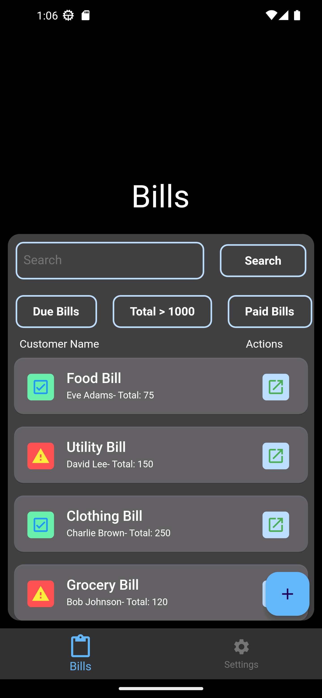
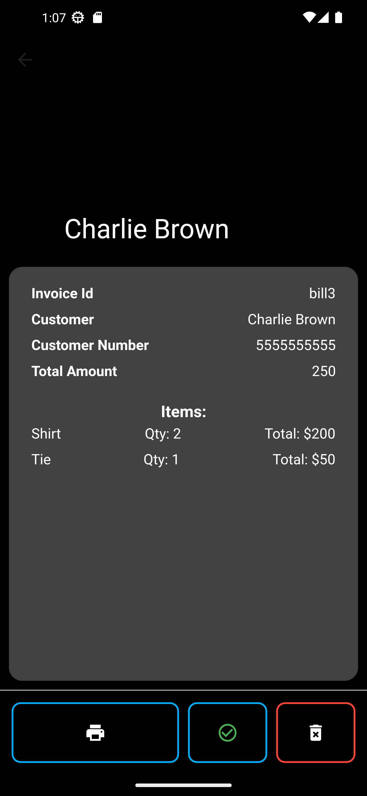
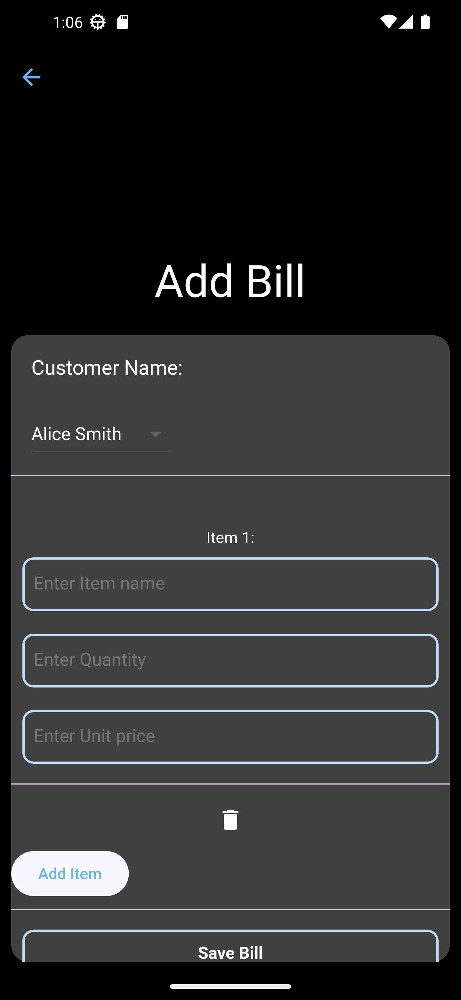

# **JMD Bill Management System**  

A **JMD Bill Management System** built using Flutter that allows users to efficiently **add, view, print, and delete bills**. It features a **One-Handed User Interface** to enhance usability and accessibility for users managing bills on mobile devices.  

---

## **Key Features**  

1. **Add Bills**  
   - Seamlessly add new bills with relevant details.  

2. **View Bills**  
   - View a list of all added bills with a clean and easy-to-navigate interface.  

3. **Print Bills**  
   - Print bills directly from the application for record-keeping or customer reference.  

4. **Delete Bills**  
   - Remove bills as needed with a simple and intuitive option.  

5. **One-Handed User Interface**  
   - The design prioritizes ease of use with one hand, ensuring smooth operation on mobile devices.  

---

## **Tech Stack**  

- **Framework:** Flutter (Dart)  
- **Libraries Used:** open_file: ^3.3.2, path_provider: ^2.1.3, pdf: ^3.11.1, printing: ^5.12.0, sqflite: ^2.3.2  
- **User Interface:** One handed user interface with Light/Dark Theme support
- **Printing Feature:** Flutter-compatible libraries for print support.  

---

## **Setup & Installation**  

Follow these steps to run the project:  

1. **Clone the repository**  
   ```bash  
   git clone https://github.com/Ketan-coder/JMD-Bill-Management-System.git  
   cd JMD-Bill-Management-System  
   ```  

2. **Install dependencies**  
   Make sure Flutter SDK is installed, then run:  
   ```bash  
   flutter pub get  
   ```  

3. **Run the application**  
   Use the following command to launch the app on a connected device or emulator:  
   ```bash  
   flutter run  
   ```  
   or
    ```bash  
   flutter run --enable-software-rendering
   ```
---

## **Screenshots**  

| **Home Page** | **View Bill** | **Add Bill** |  
|--------------|--------------|-----------------------|  
|  |  |  |  

---

## **Why One-Handed UI?**  

The app prioritizes a **one-handed design** to enable users to manage bills conveniently while multitasking. This design ensures all key actions are accessible with a single thumb swipe or tap, improving efficiency and user experience.  

---

## **Author**  

- **Developer:** Ketan Vishwakarma
- **UI/UX Designer:** Ketan Vishwakarma

---

## **License**  

This project is licensed under the MIT License.  

---  
